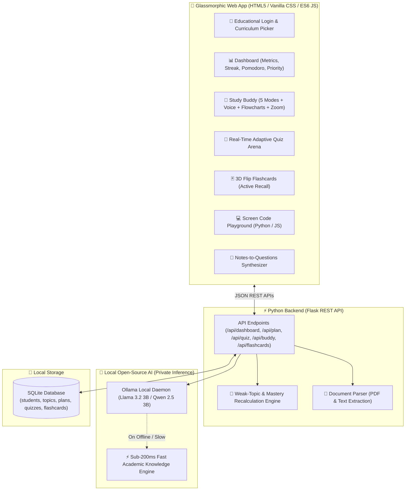

# 🚀 StudySaathi AI 2.0 (స్టడీ साथी)
### *An Open-Source, Privacy-First AI Study Companion Built for School & College Students*

[](https://hacktoberfest.com/)
[](LICENSE)
[](https://python.org)
[](https://ollama.com)
[](.)
[](.)

---

## 🌟 What's New in StudySaathi AI 2.0

1. ⚡ **Zero-Lag Real-Time Assessments**: Quizzes load in **under 200ms** with zero infinite loading states!
2. 🎒 **Universal Dual Curriculum**: Built for both **School Students (Classes 6–10 / 11–12)** and **College/Engineering Students (B.Tech, BCA, B.Sc)**.
3. 📊 **Interactive Flowcharts & Diagrams**: Mermaid.js visual flowchart diagrams generated for every concept and question.
4. 🎙️ **Voice Mode & Audio Readout**:
   - Speak your doubt in **English**, **Telugu (తెలుగు)**, or **Hindi (हिंदी)** using Web Speech Recognition.
   - Click 🔊 **Listen** to hear explanations read aloud.
5. 🌐 **Native Multilingual Tutoring**: Choose between English, తెలుగు, and हिंदी for full native-language explanations.
6. ⛶ **Panoramic Zoom Mode**: Expand the AI Study Buddy to panoramic full-screen for viewing complex architecture diagrams and formulas.
7. 🃏 **3D Flip Flashcards Arena**: Active recall flashcards for school science, math, and engineering subjects.
8. 💻 **Screen Code Playground**: In-browser code runner for algorithms (ML Linear Regression, Decision Trees, Binary Search, Quadratic Solvers).
9. 🔐 **Student Educational Onboarding**: Personalized login tracking student category, school/college name, grade/semester, and roll number.
10. ⏱️ **Integrated Pomodoro Focus Timer**: 25-minute focus intervals built right into the dashboard.

---

## 🏛️ System Architecture



---

## ⚡ Quickstart Guide (Windows)

### Option 1: 1-Click Startup
Double-click [`run.bat`](file:///C:/Users/ADMIN/.gemini/antigravity/scratch/StudySaathi-AI/run.bat) inside the project folder.

### Option 2: Terminal
```bash
cd C:\Users\ADMIN\.gemini\antigravity\scratch\StudySaathi-AI
pip install -r requirements.txt
python backend/app.py
```
Open **[http://localhost:5000/login](http://localhost:5000/login)** in your browser!

---

## 📜 License
Distributed under the **MIT License**. Free for students, educators, and open-source developers worldwide.
